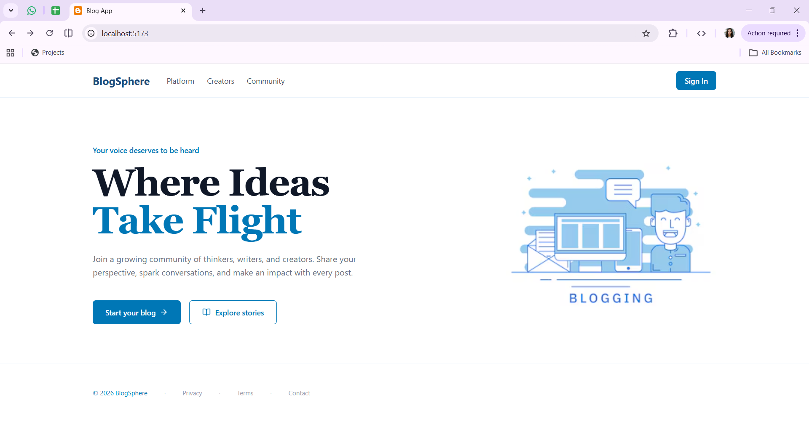
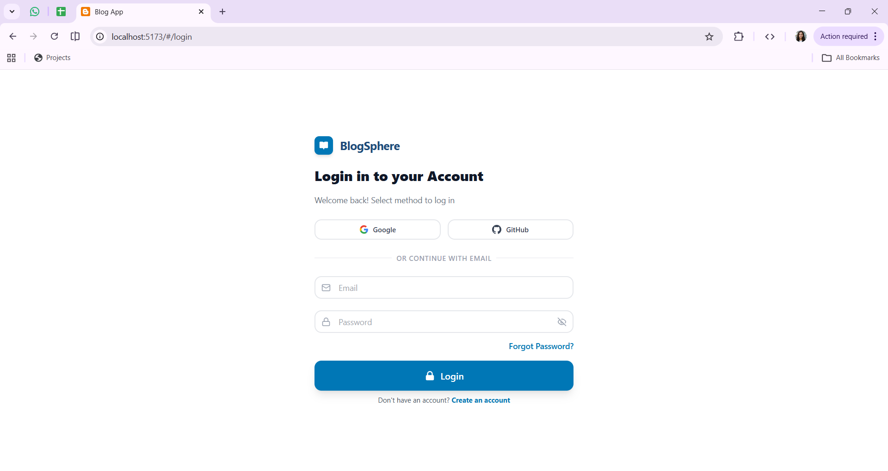
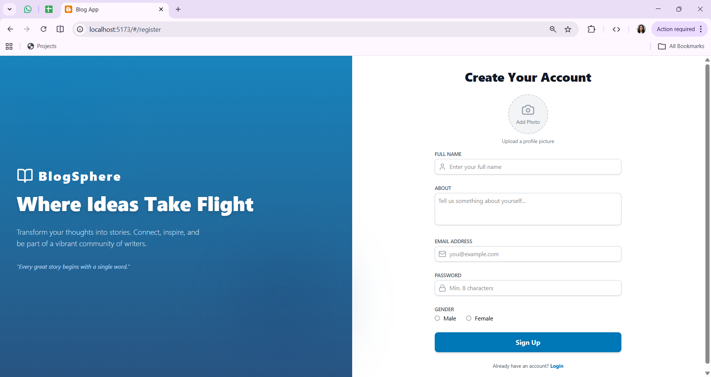
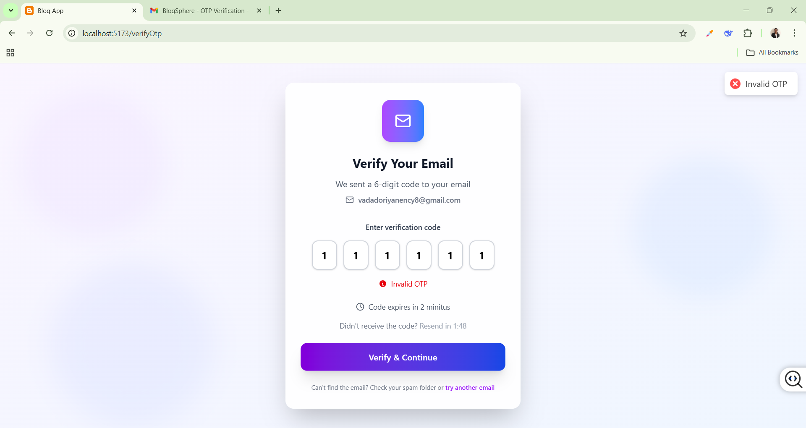
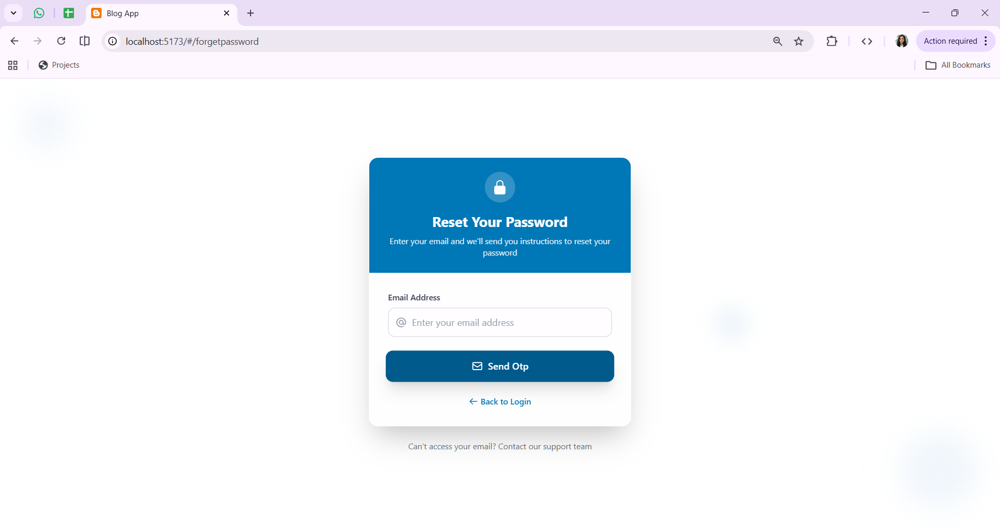
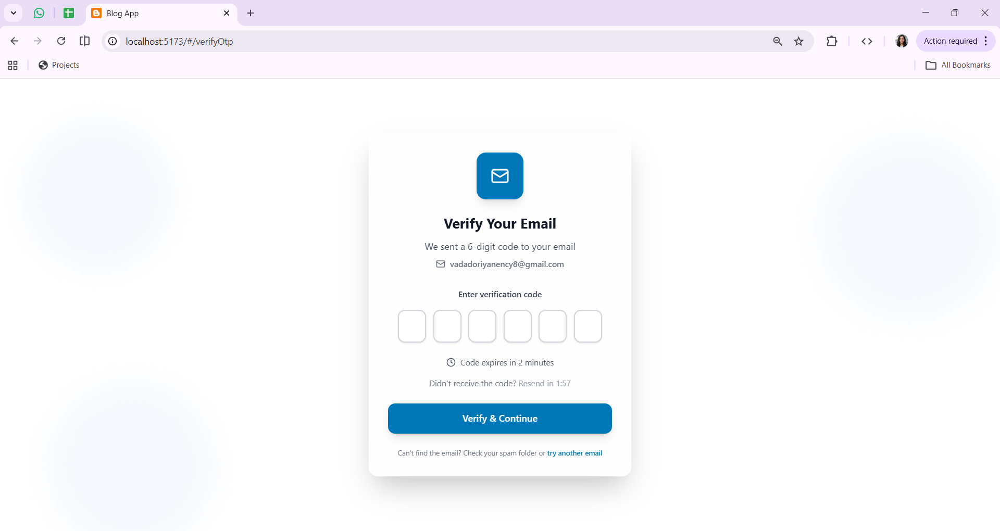
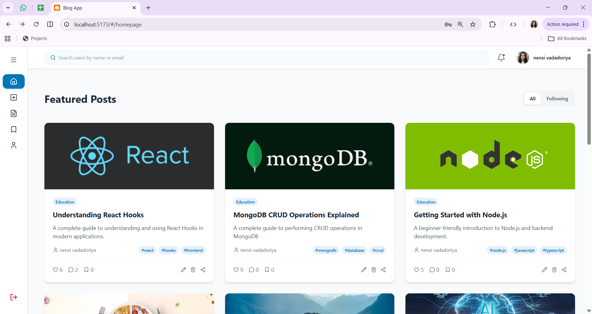
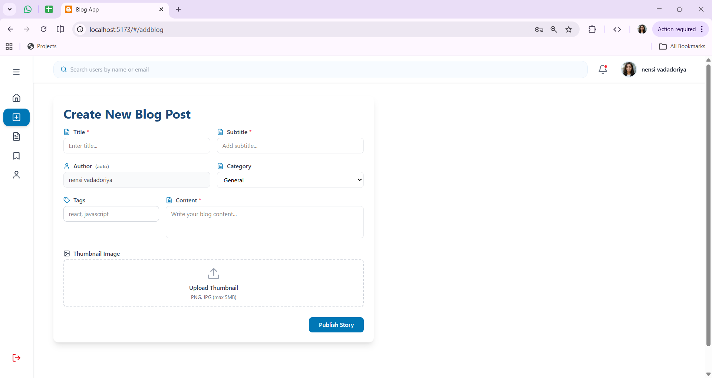

# 📝 Blog Web App

A **full-stack Blog Application** built with **React**, **Node.js**, **Express**, and **MongoDB**, featuring secure authentication, OTP-based password reset, post management, and Cloudinary image uploads.

---

## ✨ Features

- 🔐 **Secure Authentication** — Login, register, JWT, OTP password reset
- 📝 **Blog CRUD** — Create, update, delete, and view posts
- 📸 **Cloudinary Uploads** — Upload & manage blog images online
- 👤 **User Profiles** — Update profile & manage account
- 🛡️ **Middleware Protection** — Secure routes for authorized users only
- 🌐 **API Integration** — Fully connected backend with React frontend
- 📱 **Responsive UI** — Works on mobile, tablet, and desktop
- 🚀 **Live Deployment** — Fully deployed on Vercel

---

## 🛠️ Technologies Used

### **Frontend**
- React
- Tailwind CSS / CSS
- React Router
- Toast Notifications

### **Backend**
- Node.js
- Express.js
- MongoDB (Mongoose)
- Cloudinary
- Nodemailer (OTP)
- JWT Authentication

---
📸 **Preview**  

<table>
  <tr>
    <td></td>
    <td></td>
  </tr>
   <tr>
    <td></td>
    <td></td>
  </tr>
  <tr>
    <td></td>
    <td></td>
  </tr>
   <tr>
    <td></td>
    <td></td>
  </tr>
</table>
